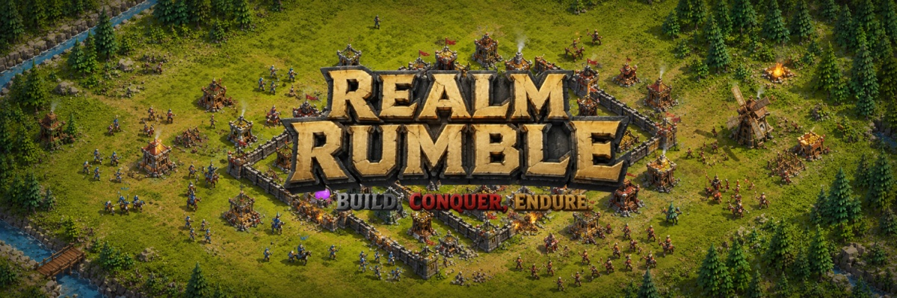

<div align="center">



### Build an empire. Raid real rivals. Earn real Solana.

An **always-on, on-chain medieval strategy game** where your realm keeps producing, marching and fighting **24/7 — even while you sleep.** Raise armies, raid other real players, climb the ranks, and earn a daily share of a real **SOL** reward pool just for holding the token.

<br/>

[](https://playrealmrumble.com)
[](https://x.com/playRealmRumble)

<br/>


</div>

---

## 📜 Table of Contents

- [What is Realm Rumble?](#-what-is-realm-rumble)
- [The Gameplay](#-the-gameplay)
  - [A living, always-on world](#a-living-always-on-world)
  - [Resources & economy](#-resources--economy)
  - [Buildings](#-buildings)
  - [The four ages](#-the-four-ages)
  - [Armies & units](#-armies--units)
  - [Combat & live raids](#-combat--live-raids)
  - [Defending your realm](#-defending-your-realm)
  - [Your hero](#-your-hero)
  - [Renown ranks](#-renown-ranks)
  - [Quests & progression](#-quests--progression)
  - [The Empires browser](#-the-empires-browser)
  - [Enemy difficulty tiers](#-enemy-difficulty-tiers)
- [Play-to-Earn: Token Rewards](#-play-to-earn-token-rewards)
- [Sign in your way](#-sign-in-your-way)
- [Tech Stack](#-tech-stack)
- [Architecture](#-architecture)
- [Local Development](#-local-development)
- [Deployment](#-deployment)
- [Roadmap](#-roadmap)
- [Links](#-links)
- [License](#-license)

---

## 🏰 What is Realm Rumble?

Realm Rumble is a **persistent, browser-based real-time strategy game** played on **one shared world map**. Think classic base-building and conquest — gather resources, raise a settlement, train armies and crush your rivals — but with two twists that make it different:

1. **The world never stops.** Your economy produces and your armies march around the clock. Log off and your realm keeps growing; come back to find rivals have made their move. There is no "match" — just one continuous world.
2. **It pays out real Solana.** Hold the game token and a slice of a **fixed daily 3 SOL pool** accrues to your wallet, claimable as real SOL. The bigger your holdings, the bigger your multiplier. No token? Play the entire game for free in **demo mode**.

> **One settlement. Four ages. A living world of rivals — and real SOL on the line.**

It runs entirely in the browser, renders the world in a **custom isometric engine**, and streams the living world to every player over WebSockets in real time.

---

## 🕹️ The Gameplay

The core loop is simple to learn and deep to master:

```
Gather  →  Build & Fortify  →  Advance Ages  →  Train Armies  →  Raid Rivals  →  Climb the Ranks
```

### A living, always-on world

Every ruler shares **one map**. Your settlement sits on it permanently. Buildings produce resources every second, armies travel in real time, and rival empires (other real players **and** AI) act on their own — whether you're watching or not. Walk your hero around your base in the isometric view, harvest resource nodes, fend off wandering brigands and wolves, and place new buildings wherever you like.

### 🪵 Resources & Economy

Four resources drive everything. Economy buildings produce them passively, second by second:

| Resource | Used for |
|---|---|
| 🪵 **Wood** | The construction backbone — almost every building needs it. |
| 🌾 **Food** | Feeds your population and trains most units. |
| 🪙 **Gold** | Funds advanced units, research and trade. |
| 🪨 **Stone** | Walls, keeps, and advancing through the later ages. |

### 🏗️ Buildings

Spend resources to raise and upgrade your settlement. Buildings fall into three roles:

- **Economy** — lumber camps, farms, mines and quarries that generate wood, food, gold and stone over time. Upgrade them to produce faster.
- **Military** — barracks and ranges that train your soldiers, plus the **Keep** for stronger defense.
- **Defensive** — **walls, towers and gates** to barricade your territory, and prestige structures like the **Temple** and **Wonder**.

Every building you place and level up raises your empire's **power** — the score that drives your rank and your standing on the leaderboard.

### 🏛️ The Four Ages

Research your way through history. Each age unlocks stronger buildings, better units and greater storage:

| Age | What it brings |
|---|---|
| 🌑 **Dark Age** | Your humble beginning — villagers and the basics. |
| 🛡️ **Feudal Age** | Barracks, spearmen and your first real army. |
| 🏰 **Castle Age** | Archers, stronger walls and serious fortifications. |
| 👑 **Imperial Age** | Knights, wonders and the mightiest structures in the realm. |

### ⚔️ Armies & Units

Train troops to defend your land and raid your enemies. Each unit has a role:

| Unit | Role |
|---|---|
| 🧑‍🌾 **Villager** | Workers — gather and build. The backbone of your economy. |
| 🗡️ **Spearman** | Cheap, sturdy infantry — your front line. |
| 🏹 **Archer** | Ranged damage from the back rank. |
| 🐎 **Knight** | Heavy cavalry — expensive, devastating, the hammer of your army. |

Gear them up in the **shop** with weapons and armour to push their stats even higher.

### 🔥 Combat & Live Raids

When you march on a rival, the battle isn't decided on paper — you **spectate it live** in the isometric world. Watch your warriors swing their swords, your knights charge, and the enemy's buildings get **razed** in real time. Winners take loot up to their army's carry capacity; the losing army takes heavy casualties. Raze enough of a foe's buildings and you cripple their economy and power.

### 🛡️ Defending Your Realm

Raids cut both ways — rivals will come for *you*. Keep a standing garrison and barricade your territory with **walls, towers and gates**. Defenders fight with their defense power, boosted by your fortifications and a home-ground advantage, so a well-walled base can turn back a much larger army. Fortify *before* you over-extend.

### 🎖️ Your Hero

You don't just command — you have an **avatar on the field**. Customise your hero, buy a **helmet** and **armour** (extra HP) and a **weapon** in the shop — and your gear shows on the character on-screen. Learn **traits** for lasting perks: some are free (Hardy, Keen Eye, Brawler), others cost coins and boost your HP, harvest yield or damage.

### ⚜️ Renown Ranks

Your **power** places you on the renown ladder. Each rank grants a **permanent harvest bonus**, so winning and building pays off forever:

| Rank | Power required | Harvest bonus |
|---|---|---|
| Peasant | 0 | 1.00× |
| Footman | 120 | 1.10× |
| Squire | 300 | 1.20× |
| Knight | 700 | 1.35× |
| Baron | 1,500 | 1.50× |
| Warlord | 3,000 | 1.70× |
| Conqueror | 6,000 | 2.00× |
| 👑 Emperor | 12,000 | 2.50× |

### 📜 Quests & Progression

As your empire grows you complete **quests** automatically — building your first lumber camp, fielding an army, reaching a new age and more. Claim each for **coins** and resources. Coins are precious: spend them to **rush** any construction, training or research to finish it instantly, or to buy hero gear and traits.

### 🌍 The Empires Browser

A live directory of **every empire on the map** — rulers and AI alike. Search and filter them, then click any empire to:

- **Scout** their power, rank, army size, buildings and raids won.
- **Spectate** their actual settlement, rendered with the real isometric engine.
- **Invade** them — march straight from the browser with the target pre-selected.

### 🤖 Enemy Difficulty Tiers

The world is seeded with AI empires across difficulty tiers, so there's always something to fight — from defenceless hamlets to fearsome conquerors. Weaker empires are far more common, so you always have someone to farm for loot and power, while the top tiers offer a real challenge.

| Tier | Name | Strength |
|---|---|---|
| 0 | Hamlet | defenceless pushovers |
| 1 | Rookie | up to 280 power |
| 2 | Squire | up to 700 |
| 3 | Knight | up to 1,600 |
| 4 | Warlord | up to 3,600 |
| 5 | Conqueror | unlimited |

---

## 💰 Play-to-Earn: Token Rewards

A single pool of **3 SOL per day** is shared among **all** token holders. Your slice is **pro-rata** to your share of supply, then boosted by your **holder tier**:

```
your daily SOL  =  (your tokens ÷ total supply)  ×  3 SOL  ×  tier multiplier
```

> 🔒 **Hard-capped.** The treasury emits **at most 3 SOL per day total** across everyone. The tier multiplier only sets how fast you accrue (your claim priority) — never extra SOL on top of the pool. When the day's pool is used up, claims resume tomorrow.

### Holder tiers

The more you hold, the higher your tier and the bigger your multiplier (up to **3×**):

| Tier | Supply share | Multiplier |
|---|---|---|
| 🥉 **Bronze** | any holder | `1.00×` |
| 🥈 **Silver** | ≥ 0.1% | `1.25×` |
| 🥇 **Gold** | ≥ 0.5% | `1.50×` |
| 🔷 **Sapphire** | ≥ 2% | `2.00×` |
| 💎 **Diamond** | ≥ 5% | `3.00×` |

### How payouts work

- **On-chain holdings.** Your SPL-token balance is read **live on-chain** against the circulating supply — no manual registration.
- **Continuous accrual.** Rewards build up from the moment you're first seen holding. You don't need to be online.
- **Claim cadence.** Your **first claim is available any time**, then once **every 6 hours** (4× a day). A live countdown shows when your next claim unlocks.
- **Real SOL, mainnet.** Claims send **real SOL on Solana mainnet**, straight from the treasury to your wallet.
- **Your dashboard** shows your tier, multiplier, claimable amount, total earned, and the day's remaining shared pool.

### Demo mode

No token? **Play the entire game for free** in demo mode with worthless in-game coins. Everything works — you just don't earn real SOL until you hold and connect a wallet.

---

## 🔐 Sign in your way

No passwords. The same identity always returns to the same empire:

| Method | What you get |
|---|---|
| 🔗 **Solana wallet** (Phantom & friends) | Empire tied to your address; holdings unlock real SOL rewards. |
| ✉️ **Email** | A full empire now; connect a wallet later from the dashboard to start earning. |
| 🎮 **Demo mode** | One click, no wallet, worthless coins — perfect for learning the ropes. |

Auth is handled by **Privy**, with wallet ownership verified by signature.

---

## 🛠️ Tech Stack

| Layer | Tech |
|---|---|
| **Frontend** | React 18 · TypeScript · Vite · Tailwind CSS · Zustand · React Router · HTML5 Canvas (custom isometric renderer) |
| **Realtime** | Socket.IO — live world snapshots & player actions stream over WebSockets |
| **Backend** | Node.js · Express · `tsx` (runtime TypeScript) · JSON persistence |
| **Web3** | Solana Web3.js · SPL-Token · Privy (wallet + email auth) |
| **Tooling** | npm workspaces monorepo · a shared types/data package consumed by both client & server |

---

## 🏗️ Architecture

Realm Rumble is a **TypeScript monorepo** with three npm workspaces. The server owns the authoritative game state, runs the simulation on a tick, streams snapshots to clients over Socket.IO, and (in production) serves the built client from the same origin.

```
realm-rumble/
├── client/        # React + Vite front-end
│   ├── src/
│   │   ├── world/     # isometric engine, renderer, character sprites & tiles
│   │   ├── game/      # in-game panels: hero, army, shop, rewards, spectate…
│   │   ├── pages/     # landing, play, empires, dashboard, docs, guide, auth
│   │   ├── components/# navbar, footer, splash screen, toasts…
│   │   └── lib/       # Zustand store, api client, web3, Privy bridge
│   └── public/        # sprites, tiles, logo, splash art
│
├── server/        # Node + Express + Socket.IO game server
│   └── src/           # world engine, bot AI, combat, auth, Solana rewards/payouts
│
└── shared/        # types + game data (units, buildings, ages, ranks, tiers)
                   #   imported by BOTH client & server — one source of truth
```

---

## 🚀 Local Development

**Prerequisites:** Node.js 18+

```bash
# install all workspaces
npm install

# run the client (5173) and server (4000) together
npm run dev
```

Then open **http://localhost:5173**. The game runs fully in **demo mode** out of the box — no configuration needed.

### Enabling token rewards

Rewards are off until configured. See `server/.env.example` and `client/.env.example`:

| Where | Variable | Purpose |
|---|---|---|
| `server/.env` | `TOKEN_MINT` | SPL token mint address |
| | `SOLANA_RPC` | Solana RPC endpoint |
| | `DAILY_SOL_POOL` | total SOL distributed per day (e.g. `1`) |
| | `TREASURY_SECRET_KEY` | payout wallet key (base58 or JSON array) |
| | `PRIVY_APP_SECRET` | Privy app secret |
| `client/.env` | `VITE_PRIVY_APP_ID` | Privy app id |
| | `VITE_SOLANA_RPC` | **public** RPC (baked into the browser bundle) |

> ⚠️ Never put a private RPC key in any `VITE_*` variable — those are compiled into the public client bundle.

---

## ☁️ Deployment

Realm Rumble deploys as a **single service** — the server builds and serves the client from the same origin (no CORS, one URL).

- **Build:** `npm install --include=dev && npm run build`
- **Start:** `npm run start`
- Listens on `process.env.PORT`; serves `client/dist` + the API + Socket.IO.
- Mount a **persistent volume** at `server/data` so the world survives redeploys.

---

## 🗺️ Roadmap

- [ ] Live token launch & on-chain rewards switched on
- [ ] Player-vs-player loot of a rival's accrued SOL on a winning raid
- [ ] Alliances & clans
- [ ] Seasonal leaderboards & rewards
- [ ] Mobile-optimised controls
- [ ] More unit types, buildings and map biomes

---

## 🔗 Links

[](https://playrealmrumble.com)
[](https://x.com/playRealmRumble)

---

## 📜 License

© 2026 Realm Rumble. All rights reserved.

<div align="center">

<br/>

**Built for strategists.** ⚔️

</div>
